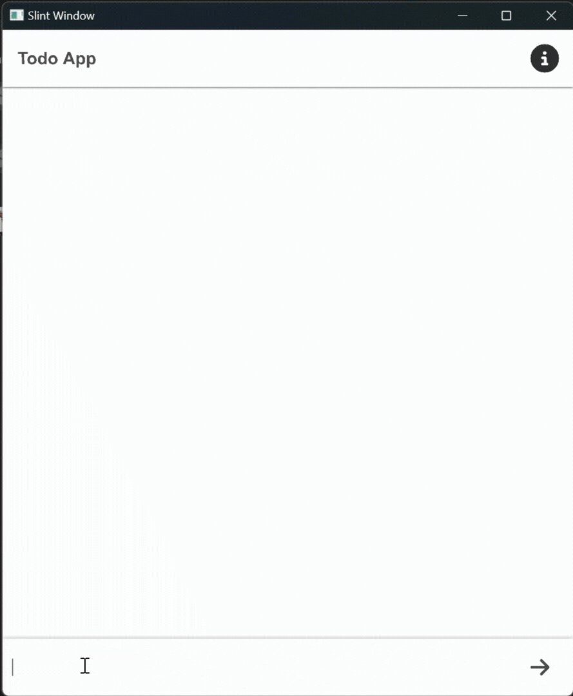

# Todo App in Slint C++

A todo application in C++ that's using [Slint](https://slint.dev) for the user interface and CMake for the build system.



## About

This is a learning sample for getting to know usage of ```.slint``` to develop lightweight yet robust GUIs. The code implements a Todo App that can track tasks allowing for adding new tasks, marking them as completed and removing them if not needed. 

This is a sample with no complex logics!

## Prerequisites

In order to run this app and build a C++ application, you need to install a few tools:

  * **[cmake](https://cmake.org/download/)** (3.21 or newer)
  * A C++ compiler that supports C++ 20 

If your target environment is Linux or Windows on an x86-64 architecture, then you may also opt into downloading one of our binary Slint packages. These are pre-compiled and require no further tools. You can find setup instructions and download links at

<https://slint.dev/docs/cpp/cmake.html#install-binary-packages>

Alternatively, this app will automatically download the Slint sources and compile them. This option requires you to install Rust by following the [Rust Getting Started Guide](https://www.rust-lang.org/learn/get-started). Once this is done, you should have the ```rustc``` compiler and the ```cargo``` build system installed in your path.

## Usage

1. Git clone and ```cd``` to the project:
    ```
    git clone https://github.com/allankoechke/todoapp-slint-cpp
    cd todoapp-slint-cpp
    ```
2. Configure with CMake
   ```
   mkdir build
   cmake -B build
   ```
3. Build with CMake
   ```
   cmake --build build
   ```
4. Run the application binary
    * Linux/macOS:
        ```
        ./build/todoapp-slint-cpp
        ```
    * Windows:
        ```
        build\todoapp-slint-cpp.exe
        ```

## Next Steps

To learn more
about the Slint APIs and the `.slint` markup language check out our [online documentation](https://slint.dev/docs/cpp/).

Enjoy!
